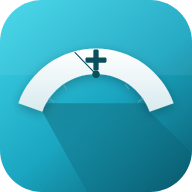

&nbsp;  &nbsp;openScale+ 
=========

Privacy-focused, offline-first weight and body-composition tracker with Bluetooth smart-scale support — an enhanced fork of [openScale](https://github.com/oliexdev/openScale), adding outbound cloud sync (Health Connect, Hevy, and a generic configurable webhook) on top of the original's Bluetooth scale support.

> [!NOTE]
> This is a fork, not the original project. It started from [oliexdev/openScale](https://github.com/oliexdev/openScale) and has since diverged to fix a long-standing bug in the Bluetooth weight-decoding path and add outbound sync integrations. If you're looking for the original, upstream project, see the link above.

# Summary :clipboard:

Monitor and track your weight, BMI, body fat, body water, muscle and other body metrics in an app that:
* has an easy to use user interface with graphs,
* supports various Bluetooth scales,
* doesn't require you to create an account,
* can be configured to only show the metrics you care about,
* respects your privacy and lets you decide what to do with your data, and
* can optionally sync your measurements outbound to Health Connect, Hevy, or your own webhook endpoint.

# Supported Bluetooth scales :rocket:
openScale+ has built-in support for a number of Bluetooth (BLE or "smart") scales from many manufacturers, e.g. Beurer, Sanitas, Yunmai, Xiaomi, Dr Trust, etc. (see model list below).

- Custom made Bluetooth scale
- Beurer BF700, BF710, BF800, BF105, BF720, BF600, BF850 and BF950
- Digoo DG-S038H
- Excelvan CF369BLE
- Exingtech Y1
- Hesley (Yunchen)
- MGB
- Medisana BS444, BS440
- Runtastic Libra
- Sanitas SBF70
- Silvercrest SBF75, SBF77
- Vigorun
- Xiaomi Mi scale v1 and v2
- Yunmai Mini and SE
- iHealth HS3
- Easy Home 64050
- Dr Trust scales
- and many more

For scales without Bluetooth, or Bluetooth scales not (yet) supported, measurements can be manually entered in a quick and easy way.

# Supported metrics :chart_with_upwards_trend:
Weight, BMI (body mass index), body water, muscle, LBM (lean body mass), body fat, bone mass, waist circumference, waist-to-height ratio, hip circumference, waist-hip ratio, visceral fat, chest circumference, thigh circumference, biceps circumference, neck circumference, body fat caliper, BMR (basal metabolic rate), TDEE (Total Daily Energy Expenditure), Calories and custom metrics. Each entry can also have an optional comment.

<b>Note:</b> don't worry if you think the list is too long: metrics you don't use can be disabled and hidden.

# Cloud sync :arrows_counterclockwise:
Sync is opt-in and outbound-only — nothing leaves your device unless you configure it.

- **Health Connect** — write measurements to Android's Health Connect.
- **Hevy** — sync weight and body-measurement data to your Hevy account.
- **Webhook** — send measurements as JSON to any endpoint you control, with a configurable payload schema and auth headers. Includes an in-app sandbox to preview the generated payload and fire a test request before relying on it.

# Other features :zap:
- Resizable widget to show the latest measurement on the home screen
- Configure your weight unit: kg, lb or st
- Set a goal to help keep your diet
- Displays all your data on a chart and in a table to track your progress
- Evaluates measurements and gives a quick visual feedback to show you if you're within or outside the recommended range given your age, sex, height etc.
- Import or export your data from/into a CSV (comma separated value) file
- Supports body fat, body water and lean body mass estimations based on scientific publications. Useful if your scale doesn't support those measurements.
- Support for multiple users
- Support for assisted weighing (e.g. for babies or pets)
- Support for people with amputations
- Optional dark theme selectable

# Privacy :lock:
This app has no ads and requests no unnecessary permissions. The location permission is only needed to find a Bluetooth scale. Once found the permission can be revoked (or never granted if Bluetooth isn't used).

By default, openScale+ doesn't send any data anywhere and not having permission to access the internet unless sync is configured is a strong guarantee of that. Cloud sync (Health Connect, Hevy, webhook) is entirely opt-in and configured per destination in Settings.

# Questions & Issues :thinking:

Found a bug or have a question about this fork specifically? Please open an issue on [this repository](https://github.com/dharmendra-gupta/open-scale-plus/issues).

# Contributing :+1:

If you found a bug, have an idea how to improve openScale+, or have a question, please open an issue or a pull request on this repository.

# Screenshots :eyes:

<table>
  <tr>
    <th>
        
    </th>
    <th>
        
    </th>
    <th>
        
    </th>
    <th>
        
    </th>
  </tr>
  
  <tr>
    <th>
        
    </th>
    <th>
        
    </th>
    <th>
        
    </th>
    <th>
        
    </th>
  </tr>
</table>

# License :page_facing_up:

openScale+ is licensed under the GPL v3, see LICENSE file for full notice.

    Copyright (C) 2025  olie.xdev <olie.xdeveloper@googlemail.com>
    Copyright (C) 2026  Dharmendra Gupta (openScale+ fork)

    This program is free software: you can redistribute it and/or modify
    it under the terms of the GNU General Public License as published by
    the Free Software Foundation, either version 3 of the License, or
    (at your option) any later version.

    This program is distributed in the hope that it will be useful,
    but WITHOUT ANY WARRANTY; without even the implied warranty of
    MERCHANTABILITY or FITNESS FOR A PARTICULAR PURPOSE.  See the
    GNU General Public License for more details.

    You should have received a copy of the GNU General Public License
    along with this program.  If not, see <http://www.gnu.org/licenses/>
